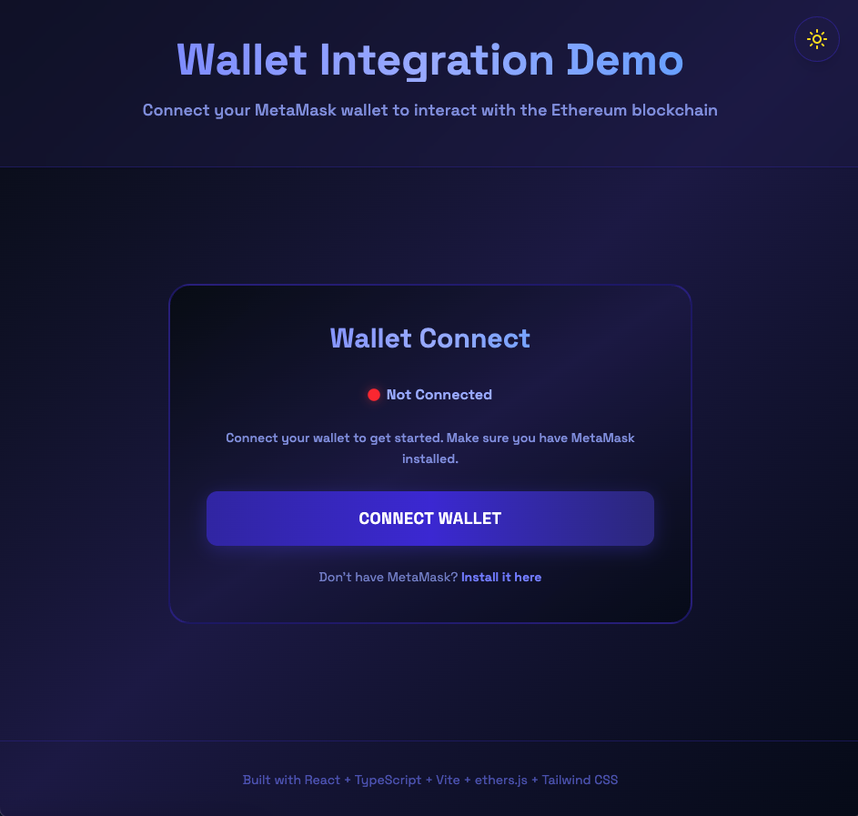
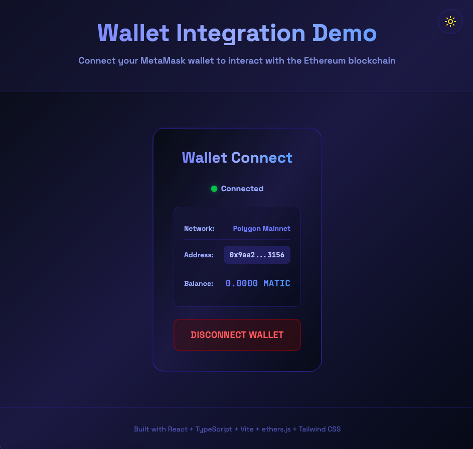

# Wallet Connection Demo

[](https://github.com/ChainsQueen/connect-wallet/actions/workflows/ci.yml)
[](https://github.com/ChainsQueen/connect-wallet/actions/workflows/deploy.yml)
[](https://reactjs.org/)
[](https://www.typescriptlang.org/)
[](https://docs.ethers.org/)
[](https://vitejs.dev/)
[](https://tailwindcss.com/)
[](LICENSE)

A modern, production-ready wallet integration with multi-chain support built with React, TypeScript, and ethers.js.

## 📑 Table of Contents

- [Screenshots](#-screenshots)
- [Quick Start](#-quick-start)
- [Features](#-features)
- [Supported Networks](#-supported-networks)
- [Testing](#-testing)
- [Tech Stack](#️-tech-stack)
- [Requirements](#-requirements)
- [Project Structure](#️-project-structure)
- [Documentation](#-documentation)
- [Development](#-development)

## 📸 Screenshots




## 🚀 Quick Start

```bash
# Install dependencies
pnpm install

# Start development server
pnpm dev
```

Visit `http://localhost:5173/connect-wallet/` and click "Connect Wallet" to connect your MetaMask wallet.

## ✨ Features

- ✅ **Multi-Chain Support** - 42+ blockchain networks including Ethereum, Polygon, Arbitrum, Base, Sei, and more
- ✅ **Connect/Disconnect Wallet** - Seamless MetaMask integration
- ✅ **Display Wallet Address** - Formatted and user-friendly
- ✅ **Real-time Balance** - Shows balance in native token (ETH, MATIC, BNB, SEI, etc.)
- ✅ **Network Detection** - Automatically detects and displays current network
- ✅ **Error Handling** - Comprehensive error messages
- ✅ **Auto-reconnection** - Remembers previous connection
- ✅ **Account Switching** - Detects and updates on account change
- ✅ **Network Switching** - Handles network changes gracefully
- ✅ **Light/Dark Mode** - Toggle between themes with preference persistence
- ✅ **Modern UI** - Beautiful gradient design with animations

## 🌐 Supported Networks

The wallet supports **42 blockchain networks** across multiple ecosystems:

### Mainnets (17)
- **Ethereum** - Ethereum Mainnet
- **Layer 2s** - Arbitrum One, Arbitrum Nova, Optimism, Base, zkSync Era, Linea, Scroll
- **Alt L1s** - Polygon, BSC, Avalanche C-Chain, Fantom Opera, Mantle, Celo, Gnosis Chain, Moonbeam
- **Emerging** - Sei Mainnet

### Testnets (23)
Ethereum (Goerli, Sepolia, Holesky), Polygon (Mumbai, Amoy), BSC, Arbitrum (Goerli, Sepolia), Optimism (Goerli, Sepolia), Base (Goerli, Sepolia), Avalanche Fuji, Fantom, zkSync Era, Linea, Scroll Sepolia, Mantle, Celo Alfajores, Gnosis Chiado, Moonbase Alpha, Sei Testnet, Intuition Testnet

### Development (2)
Localhost, Hardhat Network

> **Note**: The wallet automatically detects the network and displays the correct native token symbol (ETH, MATIC, BNB, AVAX, FTM, SEI, etc.)

## 🧪 Testing

### Run Network Validation Tests

```bash
# Run all network configuration tests
pnpm test:networks
```

This validates:
- ✅ All 42 network names are correctly mapped
- ✅ All native token symbols are properly configured
- ✅ Network detection logic works as expected

**Test Results**: 84/84 tests passing (42 networks × 2 validations)

See [tests/README.md](./tests/README.md) for detailed testing documentation.

## 📚 Documentation

See [WALLET_INTEGRATION.md](./WALLET_INTEGRATION.md) for complete documentation including:
- Architecture overview
- Implementation details
- Usage guide
- Troubleshooting

## 🛠️ Tech Stack

- **React 19.1.1** - Modern UI framework with hooks and concurrent features
- **TypeScript 5.9.3** - Type safety and enhanced developer experience
- **ethers.js 6.15.0** - Complete library for Ethereum Blockchain and multi-chain interaction
- **Vite 7.1.7** - Fast build tool with HMR (Hot Module Replacement)
- **Tailwind CSS 4.1** - Utility-first CSS framework for styling
- **Framer Motion 12.23** - Production-ready animation library

### What is ethers.js?

The ethers.js library aims to be a complete and compact library for interacting with the Ethereum Blockchain and its ecosystem. It was originally designed for use with ethers.io and has since expanded into a more general-purpose library.

**Key features used in this project:**
- `BrowserProvider` - Connects to MetaMask's injected provider
- `formatEther` - Converts wei to human-readable token amounts
- Network detection and chain ID management
- Account and balance queries

## 📋 Requirements

- Node.js 18+
- MetaMask browser extension
- pnpm (or npm/yarn)

## 🏗️ Project Structure

```
connect-wallet/
├── src/
│   ├── core/
│   │   └── hooks/
│   │       ├── use-wallet.ts      # Wallet connection & network detection
│   │       └── use-theme.ts       # Theme management
│   ├── partials/
│   │   ├── wallet-connect.tsx     # Main wallet UI component
│   │   └── theme-toggle.tsx       # Theme toggle button
│   ├── types/
│   │   └── ethereum.d.ts          # TypeScript declarations
│   ├── App.tsx                    # Main application
│   └── index.css                  # Global styles
├── tests/
│   ├── network-validation.test.js # Network configuration tests
│   ├── network-utils.ts           # Testing utilities
│   └── README.md                  # Test documentation
└── package.json
```

## 🛠️ Development

### Available Scripts

```bash
# Start development server
pnpm dev

# Build for production
pnpm build

# Preview production build
pnpm preview

# Run linter
pnpm lint

# Run network tests
pnpm test:networks
```

### Adding New Networks

1. Add network configuration to `src/core/hooks/use-wallet.ts`:
   - Add chain ID and name to `getNetworkName()`
   - Add chain ID and token symbol to `getNativeTokenSymbol()`

2. Add test cases to `tests/network-validation.test.js` and `tests/network-utils.ts`

3. Run tests to verify:
   ```bash
   pnpm test:networks
   ```

4. Commit changes with descriptive message

## 📄 License

MIT License - see [LICENSE](LICENSE) for details

---

**Built with** ❤️ **using React + TypeScript + Vite + ethers.js**
